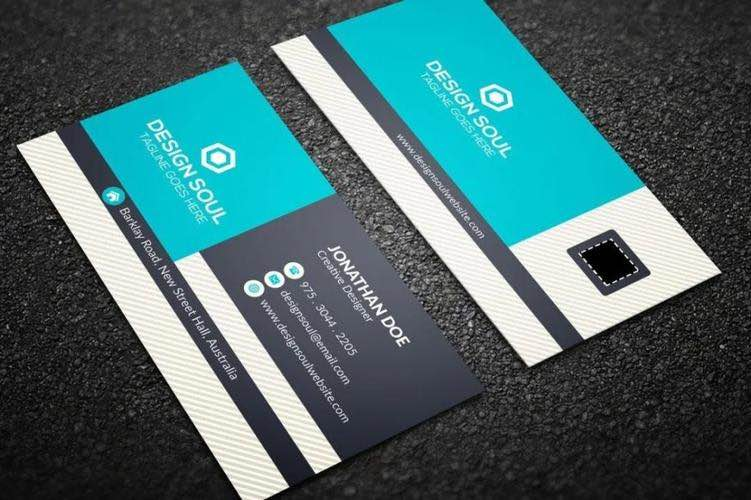

# PP-OCRv6 Studio

A local OCR workbench built around **PP-OCRv6** — PaddlePaddle's latest three-tier OCR model family (Tiny / Small / Medium). Run all three tiers on your own machine, switch between them in one click, and benchmark against real-world edge cases and the [OmniDocBench](https://github.com/opendatalab/OmniDocBench) standard evaluation set.

Built and tested on **macOS with Apple Silicon** (M-series). CoreML acceleration is enabled automatically via ONNX Runtime.

---

## What's inside

| Component | Description |
|-----------|-------------|
| `webapp/` | FastAPI backend + single-page web UI. Upload images, switch models, export results as CSV / Markdown / Excel. |
| `ppocrv6_browser.html` | Zero-dependency browser demo — no server, runs PP-OCRv6 Tiny entirely in-browser via ONNX Runtime Web. |
| `bench_local_v2.py` | Run OmniDocBench evaluation against the local API server. |
| `run_apple_vision.py` | Benchmark Apple Vision Framework (macOS built-in) on the same 18-image set. |
| `gen_result_vis.py` | Generate side-by-side detection + recognition visualisation panels for arbitrary images. |
| `assets/realworld_ocr/` | Four real-world test images + PP-OCRv6 Medium output panels. |

---

## Benchmark results

Evaluated on OmniDocBench demo set (18 document pages). Metric: `text_block` Edit Distance — **lower is better**.

| Model | Text Block ↓ | Notes |
|-------|-------------|-------|
| PP-OCRv6 Medium (34.5 MB) | **0.425** | Best accuracy; runs locally on Apple Silicon |
| PP-OCRv6 Small (7.7 MB) | 0.443 | Good balance; mobile-class size |
| PP-OCRv6 Tiny (1.5 MB) | 0.446 | Runs in browser via ONNX Runtime Web |
| Apple Vision (built-in) | 0.448 | Zero-setup; 0.16–0.54 s/image |
| PaddleOCR-VL (cloud API) | ~0.38* | Multimodal; cloud latency 6–16 s/image |

*PaddleOCR-VL evaluated separately; optimised for document layout, not isolated text blocks.

---

## Real-world test cases

Four images that push OCR beyond clean document scans: perspective angles, dot-matrix fonts, embossed low-contrast text, and seven-segment LED displays.

### Business card — perspective shot
| Original | PP-OCRv6 Medium detection |
|----------|--------------------------|
|  | |


Detection correctly locates all text regions. Medium reads: **DESIGN SOUL / JONATHAN DOE / Creative Designer / phone / url**.

---

### Dot-matrix font — fragmented glyphs


Both lines detected and recognised cleanly: **DotMatrix** (title) + **RETRO PRINT CHARM** (subtitle). Small model performs best here due to its character-set coverage.

---

### Tire sidewall — low-contrast embossed text


Embossed text on curved metal at ~30° angle. Medium reads: **TREADWEAR 220 / PLACARD IN VEHICLE / TO SEAT BEADS / ME AXLE**. This is the hardest case — Apple Vision reads "220", most multimodal models struggle with the low contrast.

---

### Elevator LED display — seven-segment digits + reflective metal


All product codes (**BVY413HSW**, **BVY411HSW**, **BVY413HVY**, **BVY411HVY**), brand name (**ORB ELEVATOR**), and URL (**orbelevator.en.alibaba.com**) correctly detected. Floor numbers (10) read correctly on all four panels.

---

## Requirements

| | Minimum | Recommended |
|-|---------|-------------|
| OS | macOS 13 Ventura | macOS 14+ Sonoma / Sequoia |
| CPU | Apple M1 | Apple M2 / M3 / M4 |
| RAM | 8 GB | 16 GB |
| Python | 3.10 | 3.11 / 3.12 |
| Disk | ~500 MB (models + deps) | — |

> **Intel Mac / Linux**: Works with `onnxruntime` (CPU only). Remove the CoreML provider lines in `webapp/server.py` or set `provider: cpu` in the UI.

---

## Setup

### 1 — Clone

```bash
git clone https://github.com/andyhu/ppocrv6-studio.git
cd ppocrv6-studio
```

### 2 — Create virtual environment

```bash
python3 -m venv .venv
source .venv/bin/activate
```

### 3 — Install dependencies

```bash
pip install -r requirements-webapp.txt
```

For Apple Silicon CoreML acceleration (recommended):

```bash
pip uninstall onnxruntime -y
pip install onnxruntime-silicon
```

### 4 — Download PP-OCRv6 ONNX models

```bash
bash scripts/download_models.sh all
```

This downloads three tarballs from the GitHub Releases page and extracts them to the expected directories:

```
ppocrv6_onnx/          ← Tiny  (detection + recognition ONNX)
ppocrv6_small_onnx/    ← Small
ppocrv6_medium_onnx/   ← Medium
```

### 5 — Start the studio

```bash
python webapp/server.py
```

Open **http://localhost:8765** in your browser.

---

## Usage

### Web UI

1. Drag and drop any image onto the upload zone.
2. Use the **Model** selector (Tiny / Small / Medium) to switch tiers — no restart needed.
3. Results show detection boxes overlaid on the image plus a full text transcript.
4. Export as **CSV**, **Markdown**, **HTML**, or **Excel** via the toolbar.
5. History is saved in `webapp/data/history.db`; accessible from the sidebar.

### Browser-only demo (no server)

Open `ppocrv6_browser.html` directly in Chrome or Safari. PP-OCRv6 Tiny runs entirely in-browser via ONNX Runtime Web + WebGPU. No installation required.

### Generate visualisation panels

```bash
python gen_result_vis.py
# Output → assets/realworld_ocr/*_panel.jpg
```

### Run OmniDocBench locally

```bash
git clone https://github.com/opendatalab/OmniDocBench.git
# Start the studio (step 5 above), then:
python bench_local_v2.py
```

Results are written to `results/`.

### Apple Vision benchmark (macOS only)

```bash
pip install ocrmac
python run_apple_vision.py
```

---

## Project structure

```
ppocrv6-studio/
├── webapp/
│   ├── server.py              # FastAPI backend (ONNX inference + REST API)
│   └── static/
│       ├── index.html         # Main web UI
│       └── tutorial.html      # Guided walkthrough
├── assets/
│   └── realworld_ocr/         # Test images + detection panel visualisations
├── scripts/
│   └── download_models.sh     # Download ONNX models from GitHub Releases
├── ppocrv6_browser.html       # Single-file in-browser demo (PP-OCRv6 Tiny)
├── bench_local_v2.py          # OmniDocBench evaluation via local API
├── run_apple_vision.py        # Apple Vision benchmark
├── gen_result_vis.py          # Side-by-side detection visualisation generator
├── requirements-webapp.txt    # Webapp Python dependencies
└── README.md
```

Models are **not included** in the repository. Run `bash scripts/download_models.sh all` to fetch them from GitHub Releases.

---

## How it works

PP-OCRv6 splits OCR into two stages:

1. **Detection** — finds text regions using a DB (Differentiable Binarization) model with LCNetV4 backbone. Receptive field expanded from 3×3 to 7×7 for better small-text and dense-text handling.
2. **Recognition** — crops each detected region and reads characters using a CTC model with a lightweight attention module. One backbone serves all three tiers (Tiny / Small / Medium differ only in width and depth).

ONNX Runtime on Apple Silicon routes both stages through **CoreML**, giving 3–52 s/image depending on model tier and image resolution.

---

## License

MIT. See [LICENSE](LICENSE).

PP-OCRv6 model weights are released under the [Apache 2.0 license](https://github.com/PaddlePaddle/PaddleOCR/blob/main/LICENSE) by PaddlePaddle.

---

*Built as part of a hands-on benchmark series — see the full write-up in [`PP-OCRv6_Khazix.html`](PP-OCRv6_Khazix.html) (Chinese).*
