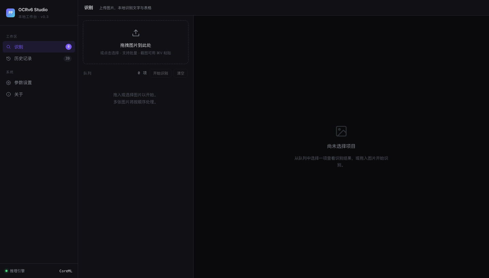
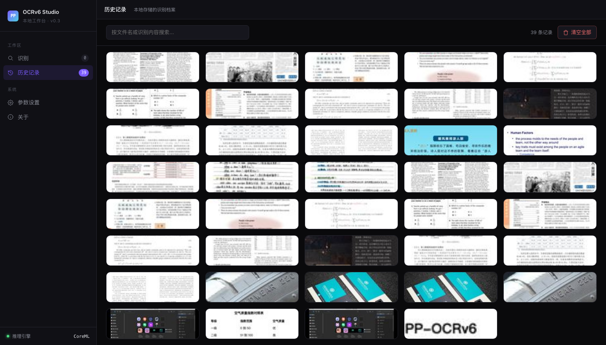
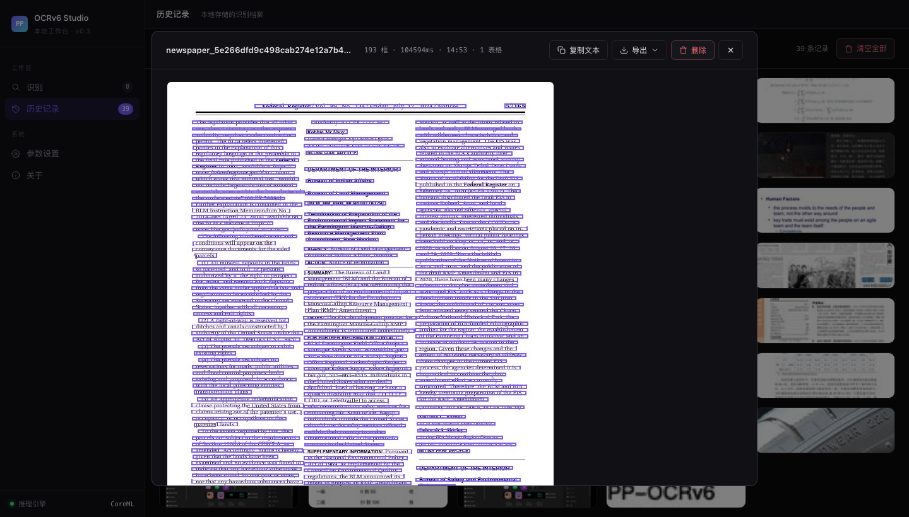
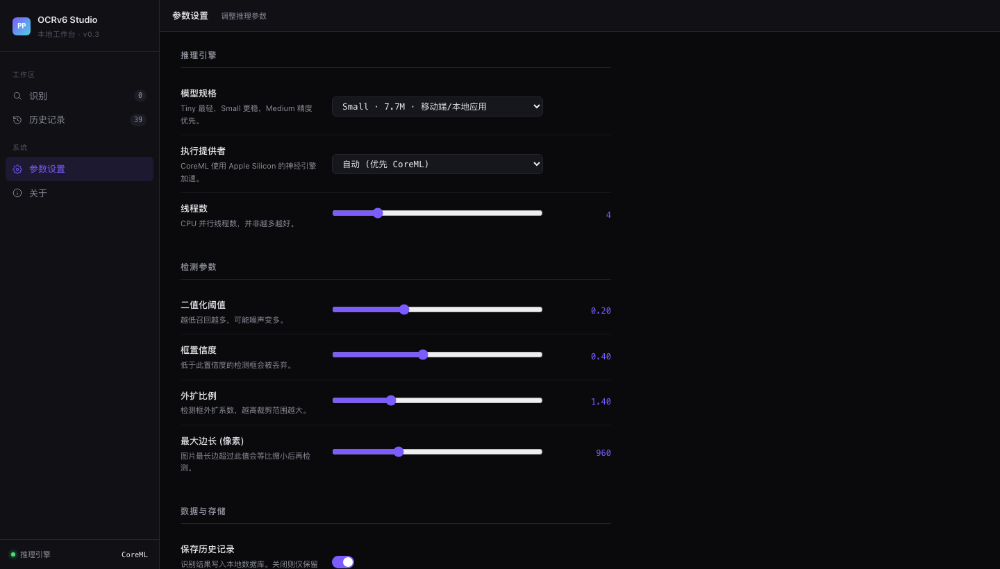
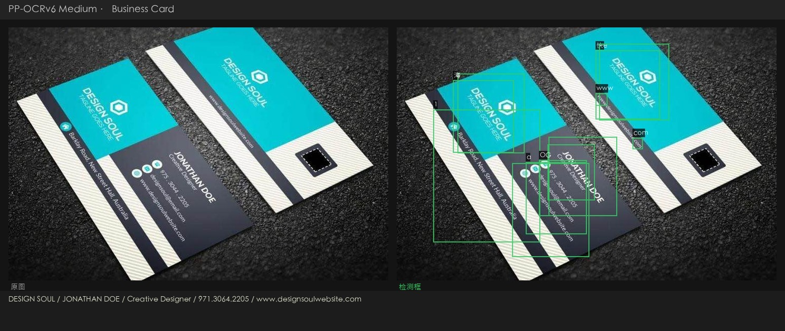
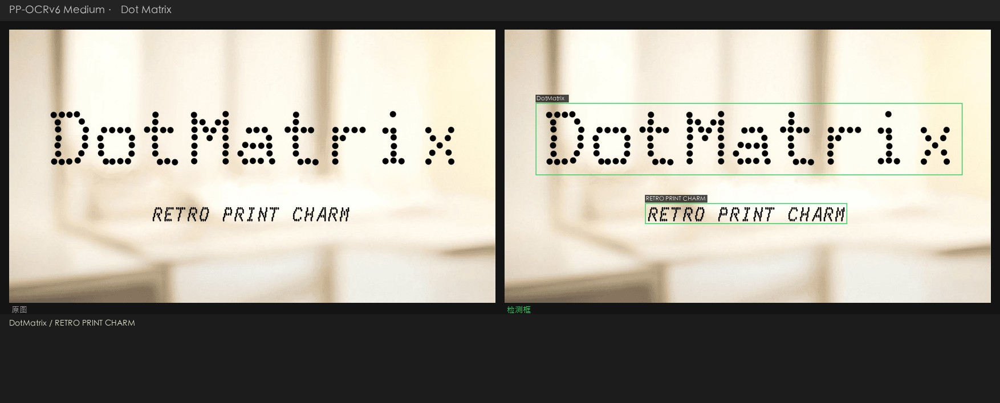
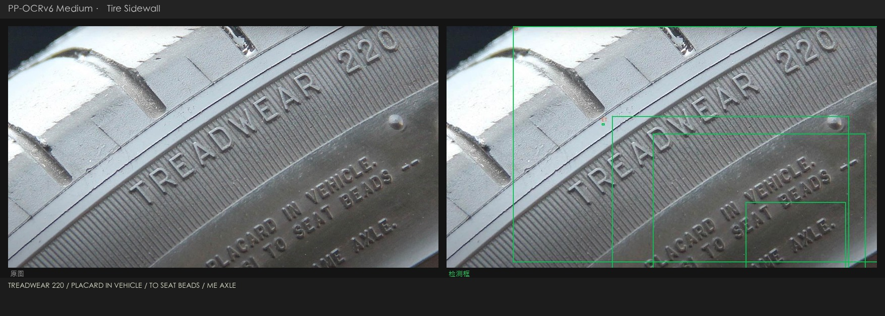
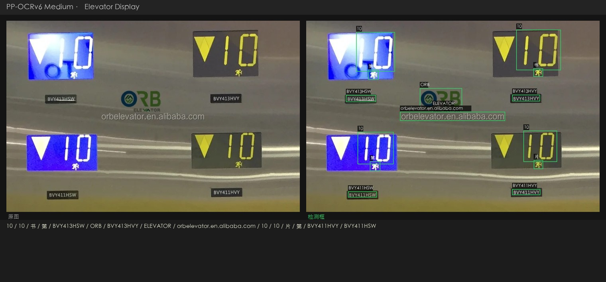

<details open>
<summary><strong>🇨🇳 中文</strong></summary>

# PP-OCRv6 Studio

围绕 **PP-OCRv6** 搭建的本地 OCR 工作台。PP-OCRv6 是飞桨最新的三档 OCR 模型家族（Tiny / Small / Medium），三档模型可以在本机一键切换，同时支持 [OmniDocBench](https://github.com/opendatalab/OmniDocBench) 标准评测集的本地跑分。

测试环境，macOS Apple Silicon（M 系列芯片）。ONNX Runtime 会自动启用 CoreML 加速，不需要额外配置。

---

## 界面截图

### 上传识别页

*拖拽上传区，支持批量处理和剪贴板粘贴（⌘V 截图直接粘）。*

### 历史记录

*39 条历史记录，每张卡片显示缩略图、文件名、识别框数量和处理耗时。*

### 识别结果详情

*报纸页，共识别出 193 个文本框。右侧面板展示完整文字转录结果。*

### 参数设置

*模型档位切换（Tiny / Small / Medium）、CoreML 开关、检测参数滑块。*

---

## 目录结构

| 组件 | 说明 |
|------|------|
| `webapp/` | FastAPI 后端 + 单页 Web UI。支持图片上传、模型切换、结果导出（CSV / Markdown / Excel）。 |
| `ppocrv6_browser.html` | 零依赖浏览器 Demo，PP-OCRv6 Tiny 通过 ONNX Runtime Web 完全在浏览器内运行，无需服务器。 |
| `bench_local_v2.py` | 通过本地 API 运行 OmniDocBench 评测。 |
| `run_apple_vision.py` | 用 macOS 内置 Apple Vision 对同一批 18 张图跑分对照。 |
| `gen_result_vis.py` | 为任意图片生成检测+识别结果可视化面板。 |
| `assets/realworld_ocr/` | 四张真实场景测试图 + PP-OCRv6 Medium 输出面板。 |

---

## 评测分数

在 OmniDocBench 演示集（18 张文档页）上评测，指标，`text_block` 编辑距离，**越低越好**。

| 模型 | 文本块编辑距离 ↓ | 备注 |
|------|----------------|------|
| PP-OCRv6 Medium（34.5 MB） | **0.425** | 精度最高，Apple Silicon 本地运行 |
| PP-OCRv6 Small（7.7 MB） | 0.443 | 性能均衡，移动端体量 |
| PP-OCRv6 Tiny（1.5 MB） | 0.446 | 可在浏览器内跑，无需服务器 |
| Apple Vision（系统内置） | 0.448 | 零配置，0.16–0.54 秒/张 |
| PaddleOCR-VL（云端 API） | ~0.38* | 多模态，云端延迟 6–16 秒/张 |

*PaddleOCR-VL 单独评测，针对文档版面优化，非孤立文本块场景，数字仅供参考。

---

## 真实场景测试

四张超出标准文档扫描范围的测试图，分别覆盖透视变形、点阵字体、浮雕低对比度文字、七段数码管四个场景。

### 名片，斜拍透视


斜拍加彩色底，透视角度让字体变形。Medium 完整读出，DESIGN SOUL / JONATHAN DOE / Creative Designer / 电话 / 网址。

### 点阵字体，字形断裂


两行文字均准确识别，DotMatrix（标题）+ RETRO PRINT CHARM（副标题）。字符集覆盖方面 Small 表现最稳。

### 轮胎压印，低对比浮雕字


曲面金属上的浮雕字，约 30° 斜角拍摄。Medium 读出，TREADWEAR 220 / PLACARD IN VEHICLE / TO SEAT BEADS / ME AXLE。这是最难的一个场景，Apple Vision 只读出了「220」，大多数多模态模型在低对比度下都吃力。

### 电梯数码屏，七段字体加反光金属底


四块面板的产品编号（BVY413HSW、BVY411HSW）、品牌名（ORB ELEVATOR）、网址（orbelevator.en.alibaba.com）均正确识别。

---

## 环境要求

| | 最低 | 推荐 |
|-|------|------|
| 操作系统 | macOS 13 Ventura | macOS 14+ Sonoma / Sequoia |
| 芯片 | Apple M1 | Apple M2 / M3 / M4 |
| 内存 | 8 GB | 16 GB |
| Python | 3.10 | 3.11 / 3.12 |
| 磁盘空间 | ~500 MB（模型 + 依赖） | — |

> **Intel Mac / Linux**，使用标准 `onnxruntime`（仅 CPU）即可跑通。在 `webapp/server.py` 中去掉 CoreML Provider 相关代码，或在 UI 设置页把推理引擎改为 CPU。

---

## 快速上手

### 第一步，克隆仓库

```bash
git clone https://github.com/andyhuo520/ppocrv6-studio.git
cd ppocrv6-studio
```

### 第二步，创建虚拟环境

```bash
python3 -m venv .venv
source .venv/bin/activate
```

### 第三步，安装依赖

```bash
pip install -r requirements-webapp.txt
```

Apple Silicon 推荐额外安装 CoreML 加速版，

```bash
pip uninstall onnxruntime -y
pip install onnxruntime-silicon
```

### 第四步，下载 ONNX 模型

```bash
bash scripts/download_models.sh all
```

脚本从 GitHub Releases 页面下载三档模型压缩包并解压，

```
ppocrv6_onnx/          ← Tiny（官方参数量 1.5 MB）
ppocrv6_small_onnx/    ← Small（7.7 MB）
ppocrv6_medium_onnx/   ← Medium（34.5 MB）
```

### 第五步，启动工作台

```bash
python webapp/server.py
```

浏览器打开 **http://localhost:8765**。

---

## 原理简述

PP-OCRv6 把 OCR 拆成两个阶段，

1. **检测**，用 DB（Differentiable Binarization）模型找出文字区域，骨干网络是 LCNetV4，感受野从 3×3 扩展到 7×7，对小字和密集排版的处理更稳。
2. **识别**，把检测到的区域逐个裁出来，用 CTC 模型加轻量注意力模块读字符。三档模型共用同一套骨干，只在宽度和深度上有差别。

ONNX Runtime 在 Apple Silicon 上把两个阶段都走 CoreML，实测单张耗时 3–52 秒，取决于档位和图片分辨率。

---

## 许可证

MIT。详见 [LICENSE](LICENSE)。

PP-OCRv6 模型权重由飞桨团队以 [Apache 2.0 许可证](https://github.com/PaddlePaddle/PaddleOCR/blob/main/LICENSE) 发布。

---

*完整的评测思路、真实场景分析和横向对比，见 [`PP-OCRv6_Khazix.html`](PP-OCRv6_Khazix.html)（中文长文）。*

</details>

---

<details>
<summary><strong>🇺🇸 English</strong></summary>

# PP-OCRv6 Studio

A local OCR workbench built around **PP-OCRv6** — PaddlePaddle's latest three-tier OCR model family (Tiny / Small / Medium). Run all three tiers on your own machine, switch between them in one click, and benchmark against real-world edge cases and the [OmniDocBench](https://github.com/opendatalab/OmniDocBench) standard evaluation set.

Built and tested on **macOS with Apple Silicon** (M-series). CoreML acceleration is enabled automatically via ONNX Runtime.

---

## Screenshots

### Upload & Recognize

*Drag-and-drop upload zone. Supports batch processing and clipboard paste (⌘V).*

### History Grid

*39-item history grid. Each card shows the thumbnail, filename, box count, and processing time.*

### OCR Result Detail

*Newspaper page with 193 detection boxes. The right panel shows the full text transcript.*

### Settings

*Model tier selector (Tiny / Small / Medium), CoreML toggle, and detection parameter sliders.*

---

## What's inside

| Component | Description |
|-----------|-------------|
| `webapp/` | FastAPI backend + single-page web UI. Upload images, switch models, export results as CSV / Markdown / Excel. |
| `ppocrv6_browser.html` | Zero-dependency browser demo — no server, runs PP-OCRv6 Tiny entirely in-browser via ONNX Runtime Web. |
| `bench_local_v2.py` | Run OmniDocBench evaluation against the local API server. |
| `run_apple_vision.py` | Benchmark Apple Vision Framework (macOS built-in) on the same 18-image set. |
| `gen_result_vis.py` | Generate side-by-side detection + recognition visualisation panels for arbitrary images. |
| `assets/realworld_ocr/` | Four real-world test images + PP-OCRv6 Medium output panels. |

---

## Benchmark results

Evaluated on OmniDocBench demo set (18 document pages). Metric: `text_block` Edit Distance — **lower is better**.

| Model | Text Block ↓ | Notes |
|-------|-------------|-------|
| PP-OCRv6 Medium (34.5 MB) | **0.425** | Best accuracy; runs locally on Apple Silicon |
| PP-OCRv6 Small (7.7 MB) | 0.443 | Good balance; mobile-class size |
| PP-OCRv6 Tiny (1.5 MB) | 0.446 | Runs in browser via ONNX Runtime Web |
| Apple Vision (built-in) | 0.448 | Zero-setup; 0.16–0.54 s/image |
| PaddleOCR-VL (cloud API) | ~0.38* | Multimodal; cloud latency 6–16 s/image |

*PaddleOCR-VL evaluated separately; optimised for document layout, not isolated text blocks.

---

## Real-world test cases

Four images that push OCR beyond clean document scans: perspective angles, dot-matrix fonts, embossed low-contrast text, and seven-segment LED displays.

### Business card — perspective shot


Detection correctly locates all text regions despite the skewed angle and coloured background. Medium reads: **DESIGN SOUL / JONATHAN DOE / Creative Designer / phone / url**.

### Dot-matrix font — fragmented glyphs


Both lines detected and recognised cleanly: **DotMatrix** (title) + **RETRO PRINT CHARM** (subtitle). Small model performs best here due to its character-set coverage.

### Tire sidewall — low-contrast embossed text


Embossed text on curved metal at ~30° angle. Medium reads: **TREADWEAR 220 / PLACARD IN VEHICLE / TO SEAT BEADS / ME AXLE**. Hardest case — Apple Vision reads only "220", most multimodal models struggle with the low contrast.

### Elevator LED display — seven-segment digits + reflective metal


All product codes (**BVY413HSW**, **BVY411HSW**), brand name (**ORB ELEVATOR**), and URL (**orbelevator.en.alibaba.com**) correctly detected across four panels.

---

## Requirements

| | Minimum | Recommended |
|-|---------|-------------|
| OS | macOS 13 Ventura | macOS 14+ Sonoma / Sequoia |
| CPU | Apple M1 | Apple M2 / M3 / M4 |
| RAM | 8 GB | 16 GB |
| Python | 3.10 | 3.11 / 3.12 |
| Disk | ~500 MB (models + deps) | — |

> **Intel Mac / Linux**: Works with `onnxruntime` (CPU only). Remove the CoreML provider lines in `webapp/server.py` or set `provider: cpu` in the UI.

---

## Setup

### 1 — Clone

```bash
git clone https://github.com/andyhuo520/ppocrv6-studio.git
cd ppocrv6-studio
```

### 2 — Create virtual environment

```bash
python3 -m venv .venv
source .venv/bin/activate
```

### 3 — Install dependencies

```bash
pip install -r requirements-webapp.txt
```

For Apple Silicon CoreML acceleration (recommended):

```bash
pip uninstall onnxruntime -y
pip install onnxruntime-silicon
```

### 4 — Download PP-OCRv6 ONNX models

```bash
bash scripts/download_models.sh all
```

This downloads three tarballs from the GitHub Releases page and extracts them:

```
ppocrv6_onnx/          ← Tiny  (1.5 MB official params)
ppocrv6_small_onnx/    ← Small (7.7 MB)
ppocrv6_medium_onnx/   ← Medium (34.5 MB)
```

### 5 — Start the studio

```bash
python webapp/server.py
```

Open **http://localhost:8765** in your browser.

---

## How it works

PP-OCRv6 splits OCR into two stages:

1. **Detection** — finds text regions using a DB (Differentiable Binarization) model with LCNetV4 backbone. Receptive field expanded from 3×3 to 7×7 for better small-text and dense-text handling.
2. **Recognition** — crops each detected region and reads characters using a CTC model with a lightweight attention module. One backbone serves all three tiers (Tiny / Small / Medium differ only in width and depth).

ONNX Runtime on Apple Silicon routes both stages through **CoreML**, giving 3–52 s/image depending on model tier and image resolution.

---

## License

MIT. See [LICENSE](LICENSE).

PP-OCRv6 model weights are released under the [Apache 2.0 license](https://github.com/PaddlePaddle/PaddleOCR/blob/main/LICENSE) by PaddlePaddle.

---

*Built as part of a hands-on benchmark series — see the full write-up in [`PP-OCRv6_Khazix.html`](PP-OCRv6_Khazix.html) (Chinese).*

</details>
